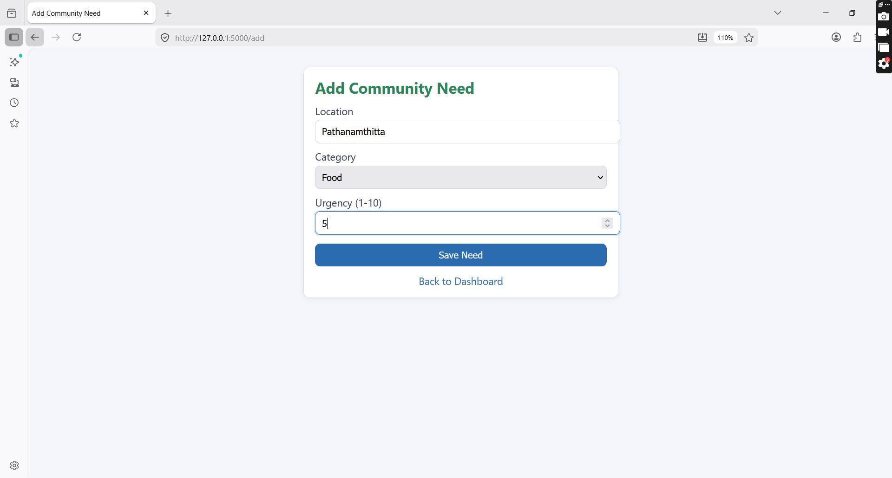
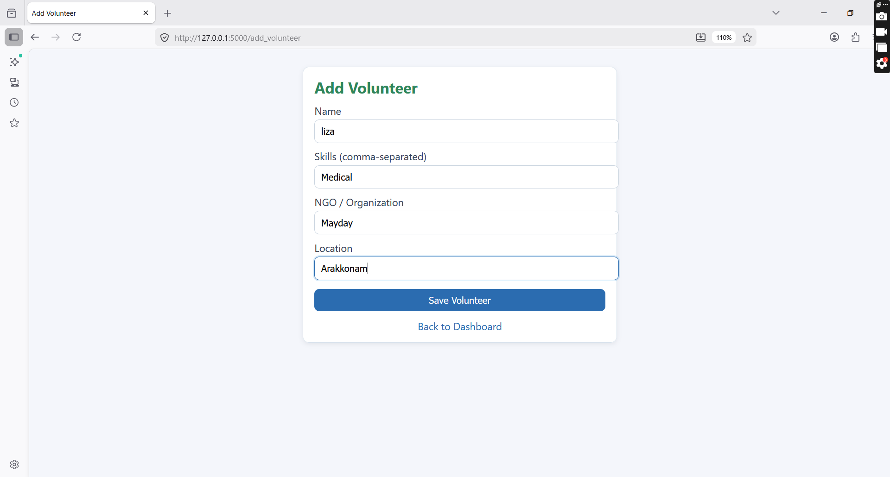

## 🖥️ Frontend Templates

The project uses simple HTML templates to provide a clean and user-friendly interface for data entry and visualization. These templates are rendered using Flask’s Jinja2 templating engine.

---

## 📸 Preview

### ➕ Add Need Form
!

### 👤 Add Volunteer Form

---

### 📄 `index.html` – Dashboard
- Displays all community needs in a structured table  
- Shows:
  - ID  
  - Location  
  - Category  
  - Urgency  
  - Score  
  - Priority  
  - Suggested Volunteers  
- Tasks are **sorted by score (highest first)**  
- Rows are **color-coded** based on priority:
  - 🔴 High → Light Red  
  - 🟡 Medium → Yellow  
  - 🟢 Low → Light Green  
- Provides a quick overview for decision-making  

---

### 📝 `add_need.html` – Add Task Form
- Used to input new community needs  
- Fields included:
  - Location  
  - Category (Food, Medical, Education, etc.)  
  - Urgency (1–10 scale)  
- Data entered here is stored in the database and reflected in the dashboard  

---

### 👤 `add_volunteer.html` – Add Volunteer Form 
- Allows adding volunteer details  
- Fields included:
  - Name  
  - Skill  
  - Location  
- Used for matching volunteers with relevant tasks  

---

### ⚙️ Template Features
- Built using **HTML + basic CSS**  
- Uses **Flask Jinja2** for dynamic data rendering  
- Lightweight and responsive design  
- Easy to modify and extend  

---

### 🎯 Purpose
These templates act as the **user interface layer**, enabling:
- Easy data entry  
- Clear visualization of priorities  
- Seamless interaction with backend logic  
